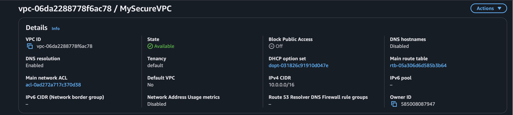
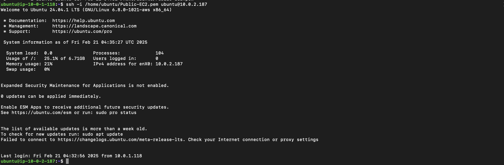

# 🛡️ AWS VPC Security Lab

Spin up a two‑tier VPC—public bastion in front, private subnet in back—and lock it down. Fast, hands‑on, zero fluff.

  

---

## 🚀 What You’ll Learn
- Carve a VPC into public & private subnets  
- Lock inbound SSH to a bastion host only  
- Layer Security Groups **and** Network ACLs for extra defense  
- Turn on VPC Flow Logs and read the receipts  
- Troubleshoot the “why can’t I SSH?” classics  

---

## 📐 Architecture Snapshot

Successful hop looks like this:  

---

## ⚙️ Architecture Components
- **VPC `10.0.0.0/16`** – your IP sandbox  
- **Public subnet `10.0.1.0/24`** – bastion EC2, Elastic IP, SSH from your IP  
- **Private subnet `10.0.2.0/24`** – workload EC2, no direct internet  
- **Internet Gateway** – gateway for the bastion  
- **Route table** – public subnet routes `0.0.0.0/0` → IGW  
- **Security Groups** – bastion‑sg (SSH from you) → private‑sg (SSH from bastion)  
- **Network ACLs** – extra “nope” layer at subnet edge  
- **VPC Flow Logs** – packet receipts to CloudWatch/S3  

---

## 🗺️ Folder Structure
AWS-VPC-Security/
├── docs/
│   ├── setup-guide.md
│   ├── security-hardening.md
│   └── troubleshooting.md
├── screenshots/
├── LICENSE
└── README.md

---

## ✍️ Notes
- Terraform flavor coming soon  
- Least‑privilege IAM policy sample on deck  
- 90‑second demo GIF planned  
- PRs welcome—open an issue if anything feels off  

---

## License
MIT
