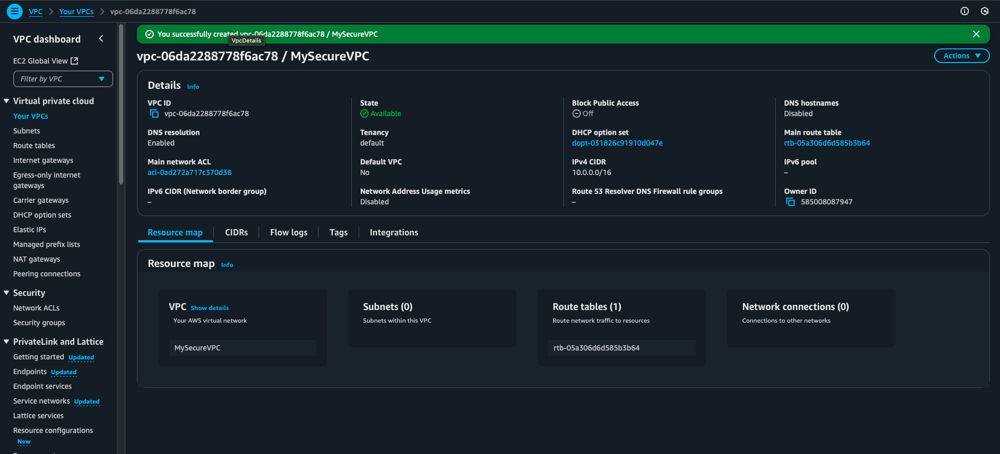

# 🛡️ AWS VPC Security Lab

Build a two‑tier VPC—public bastion up front, private subnet behind it—and lock it down with Security Groups, NACLs, and Flow Logs. Hands‑on, click‑by‑click, zero fluff.

[](LICENSE)  
[](../../commits)

---

## 🎯 What You'll Learn
- Slice a VPC into **public** and **private** subnets  
- Pin inbound SSH to a single bastion host  
- Chain Security Groups *and* Network ACLs for layered defense  
- Turn on VPC Flow Logs and read the receipts  
- Troubleshoot “can’t SSH” and “no Internet” headaches  

---

## 🧪 Lab Tasks
- Create the VPC, subnets, route tables, and Internet Gateway  
- Launch a bastion EC2 in the public subnet and a workload EC2 in the private subnet  
- Attach an Elastic IP to the bastion  
- Test SSH: **laptop → bastion → private host**  
- Enable Flow Logs and watch traffic in CloudWatch  

---

## ⚙️ Architecture Components
- **VPC `10.0.0.0/16`** — your IP sandbox  
- **Public subnet `10.0.1.0/24`** — bastion EC2, Elastic IP, SSH allowed from your IP  
- **Private subnet `10.0.2.0/24`** — workload EC2, no direct Internet  
- **Internet Gateway** — outbound door for the bastion (add NAT if private hosts need outbound)  
- **Route table** — public subnet routes `0.0.0.0/0` to the IGW  
- **Security Groups** — bastion-sg (SSH from you) → private-sg (SSH from bastion)  
- **Network ACLs** — extra “nope” layer on the subnet edge  
- **VPC Flow Logs** — packet receipts to CloudWatch or S3  

---

## 🖼️ Screenshots

**VPC Created**  


**Security Group Rules**  
  


**SSH Hop Success**  


*If any images fail to load, please verify that the screenshots folder is in the correct relative location and that the filenames match exactly (including case sensitivity).*

---

## 📁 Folder Structure
AWS-VPC-Security/
├── README.md
├── cloudformation/
│   └── vpc-bastion.yaml        # optional IaC (work in progress)
├── docs/
│   ├── setup-guide.md
│   ├── security-hardening.md
│   └── troubleshooting.md
├── screenshots/
│   ├── ElasticIPAssociatedSuccess.png
│   ├── ElasticIPSummary.png
│   ├── InternetGatewayAttached.png
│   ├── MySecureVPC.png
│   ├── MySecureVPCCreate.png
│   ├── PingPrivate-EC2.png
│   ├── Private-EC2Summary.png
│   ├── PrivateSecurityGroupCreated.png
│   ├── PrivateSubnet.png
│   ├── Public-EC2Summary.png
│   ├── PublicSecurityGroupCreated.png
│   ├── PublicSubnet.png
│   ├── RouteUpdate.png
│   ├── SSHLocaltoPublic.png
│   ├── SSHPublictoPrivateSuccess.png
│   ├── Subnets.png
│   └── SubneetAssociationsUpdate.png
└── LICENSE

---

## 🚀 How to Run the Lab
1. **Create VPC & subnets** – AWS Console → VPC Wizard → “VPC with Public and Private Subnets”  
2. **Attach an Internet Gateway** and update the public subnet route table  
3. **Spin up EC2 instances**  
   - Bastion: public subnet, bastion-sg, Elastic IP  
   - Private host: private subnet, private-sg  
4. **SSH Flow Test**  
   ```bash
   # from your laptop
   ssh -i BastionKey.pem ubuntu@<Elastic-IP>

   # from the bastion
   ssh -i PrivateKey.pem ubuntu@<Private-EC2-Private-IP>
   ```

5.	Enable VPC Flow Logs – send to a CloudWatch log group, then tail the traffic

⸻

📓 Mini Playbook — SSH Hop

Scenario: You need to reach a private EC2 instance.
	•	SSH to the bastion using its Elastic IP.
	•	From the bastion, SSH to the private host’s private IP.
	•	Run who or lastlog to confirm only bastion traffic hits the private box.

Outcome: The private instance remains invisible to the Internet; only the bastion can access it.

⸻

💾 Notes
	•	The CloudFormation template is a stub—finish it or swap in Terraform if you prefer.
	•	All how-to docs live in /docs/; screenshots in /screenshots/.
	•	IAM setup follows least-privilege: separate SGs and no stored keys on servers.
	•	Open a PR or issue if you spot a typo or have an improvement!

⸻

📝 License

MIT
