# AWS VPC Security Project 🚀

## Overview
This project documents the setup of a secure AWS Virtual Private Cloud (VPC) with a Bastion Host, a Private EC2 Instance, and properly configured firewall rules. The setup is performed **manually** via the AWS Management Console, with **Elastic IP** assignment for a stable public IP on the Bastion Host. Detailed steps, screenshots, and best practices are included.

## Features
✅ **Public-EC2 (Bastion Host)** for secure access.  
✅ **Private-EC2** with no direct public exposure.  
✅ **Elastic IP** for a consistent public IP on the Bastion Host.  
✅ **Internet Gateway & Route Tables** for controlled access.  
✅ **Key-based SSH authentication** (No password login).  
✅ **Root login disabled** for added security.  
✅ **Security Groups & Network ACLs** for access control.  
✅ **Step-by-step guide with screenshots.**  

---

## Project Structure
```
AWS-VPC-Security/
├── README.md                # Project overview & usage guide
├── docs/                    # Detailed setup and configuration guides
│   ├── setup-guide.md        # Step-by-step AWS VPC setup with screenshots (if desired)
│   ├── security-hardening.md # Best security practices
│   └── troubleshooting.md    # Common issues and fixes
├── screenshots/             # AWS console and CLI screenshots
└── LICENSE                  # License for the project
```

---

## Requirements

✅ **AWS Account** with IAM permissions to create VPC resources.  
✅ **AWS Management Console Access** (No CLI automation required).  
✅ **SSH Key Pair** for secure authentication.  
✅ **Basic Networking & AWS Knowledge.**  

---

## Setup & Configuration

### **Step 1: Create the VPC**
1. Navigate to **AWS Management Console** → **VPC Dashboard**.
2. Click **Create VPC**.
3. Set **CIDR Block** to `10.0.0.0/16`.
4. Enable **DNS Support** and **DNS Hostnames**.
5. Save & note the **VPC ID**.
6. 📸 ****

### **Step 2: Configure Subnets**
1. Create a **Public Subnet** (e.g., `10.0.1.0/24` in `us-east-1a`).
2. Create a **Private Subnet** (e.g., `10.0.2.0/24` in `us-east-1b`).
3. 📸 **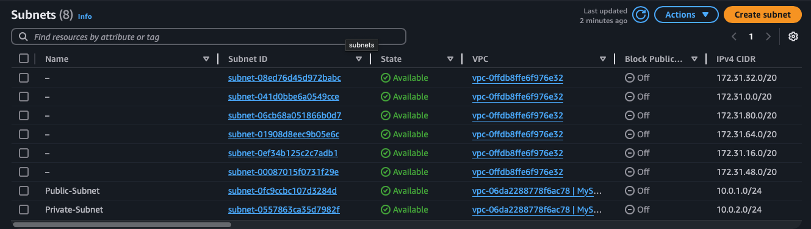**
4. 📸 **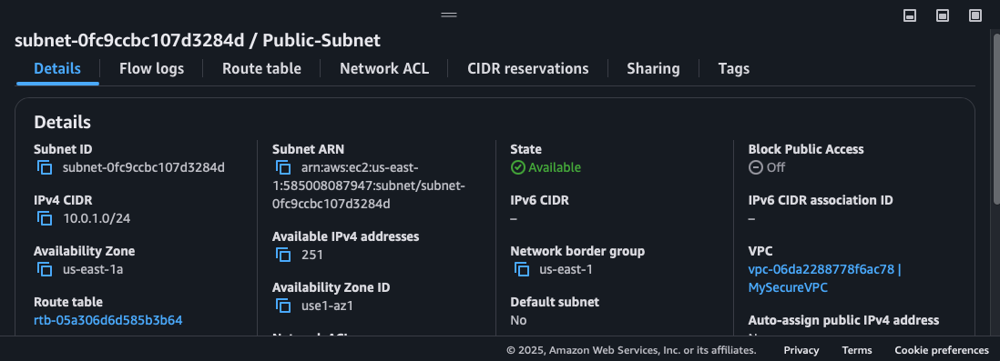**
5. 📸 **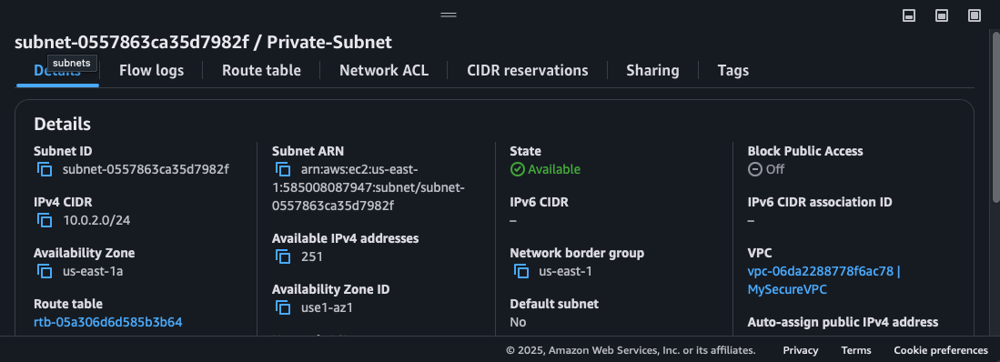**

### **Step 3: Set Up Internet Gateway & Route Tables**
1. Create an **Internet Gateway**, then **attach** it to your VPC.
2. Create a **Route Table** for your public subnet:
   - Add a route: `0.0.0.0/0` → **Internet Gateway**.
   - Associate the **Public Subnet** with this new **Public Route Table**.
3. 📸 **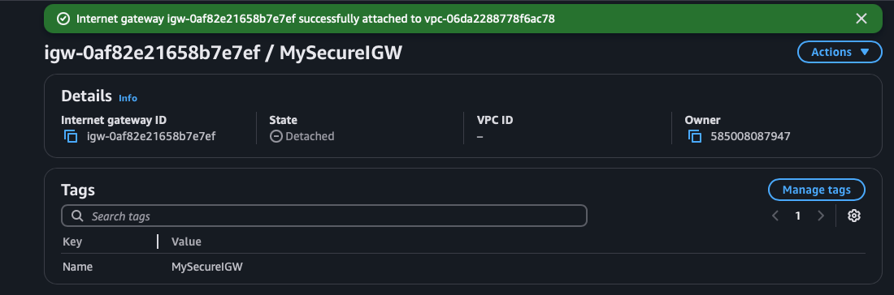**
4. 📸 **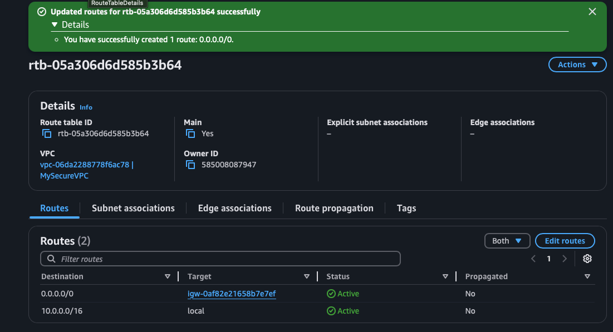**

### **Step 4: Security Group Rules**
1. **Bastion SG** (assigned to your Public EC2):
   - Allow **SSH** (`22/TCP`) from your IP address.
2. **Private EC2 SG**:
   - Allow **SSH** (`22/TCP`) only **from the Bastion SG** (or the Bastion Host’s private IP).
3. 📸 **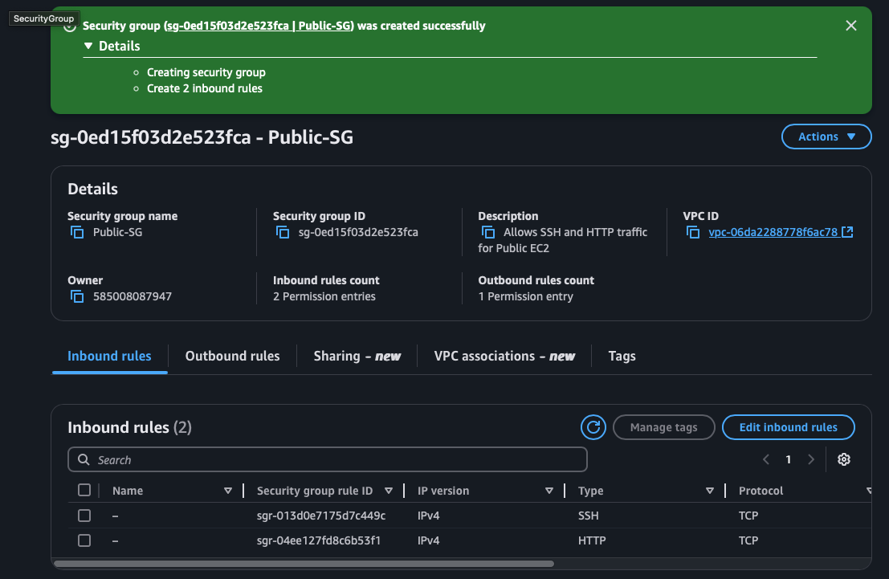**
4. 📸 **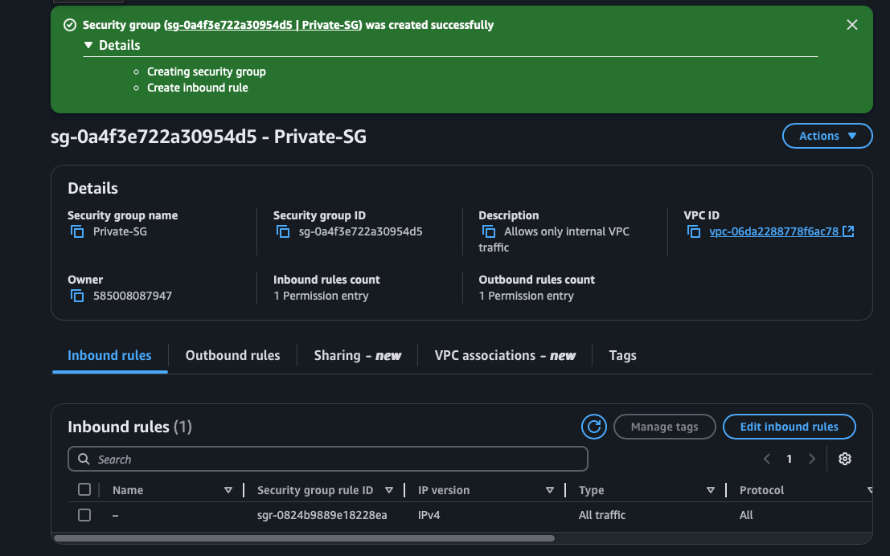**

### **Step 5: Deploy Bastion & Private EC2**
1. Launch a **Bastion Host** (Public EC2) in the **Public Subnet**:
   - Assign it the **Bastion SG**.
   - Generate or choose an existing **key pair** (e.g., `Public-EC2.pem`).
2. Launch a **Private EC2** in the **Private Subnet**:
   - Assign it the **Private EC2 SG**.
   - Use a key pair that can be accessed from the Bastion Host.
3. 📸 **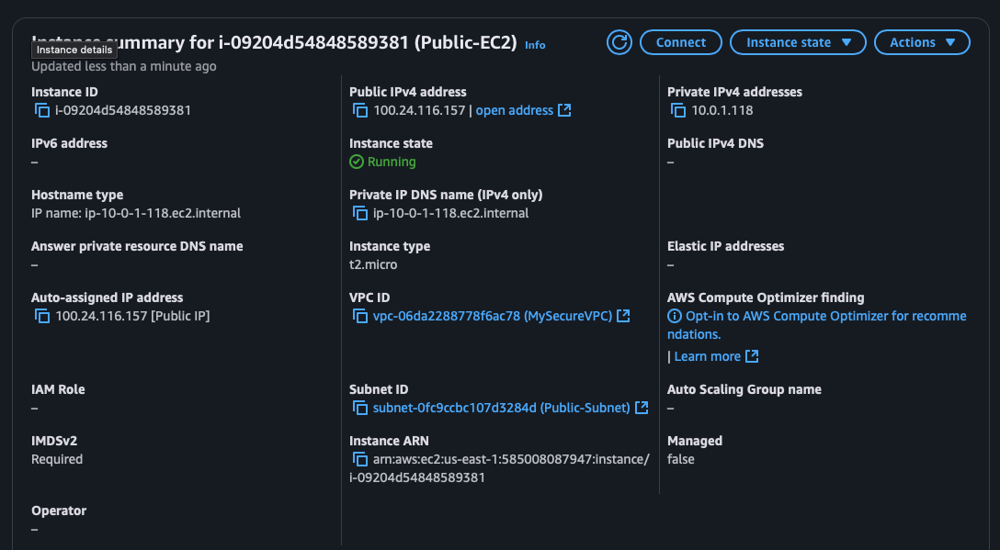**
4. 📸 **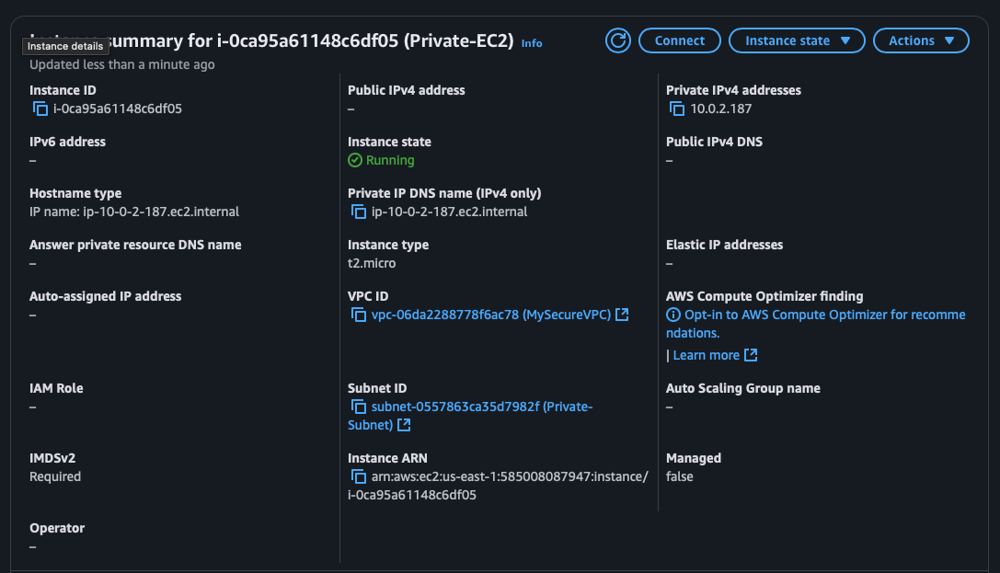**

### **Step 6: Allocate & Associate an Elastic IP**
1. Go to **Elastic IPs** in your EC2 dashboard.
2. Click **Allocate Elastic IP address**.
3. Under **Network Border Group**, select the same region as your Bastion Host.
4. After allocation, select the **Elastic IP**, then click **Actions** → **Associate Elastic IP address**.
5. Associate it with the Bastion Host’s **Network Interface** (or Instance ID).
6. 📸 **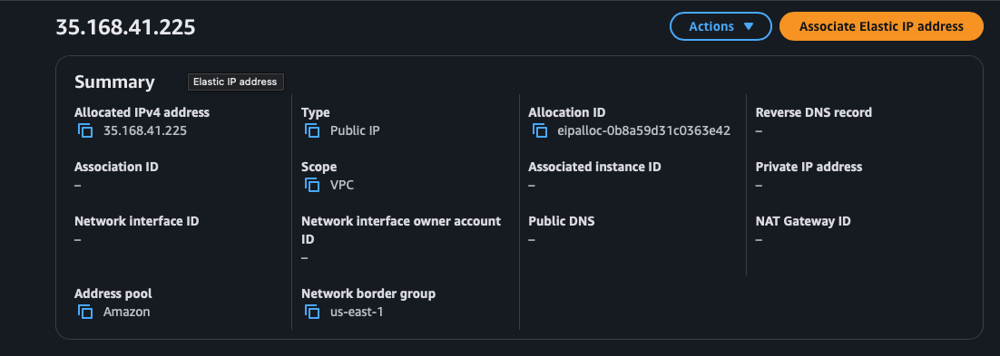**
7. 📸 **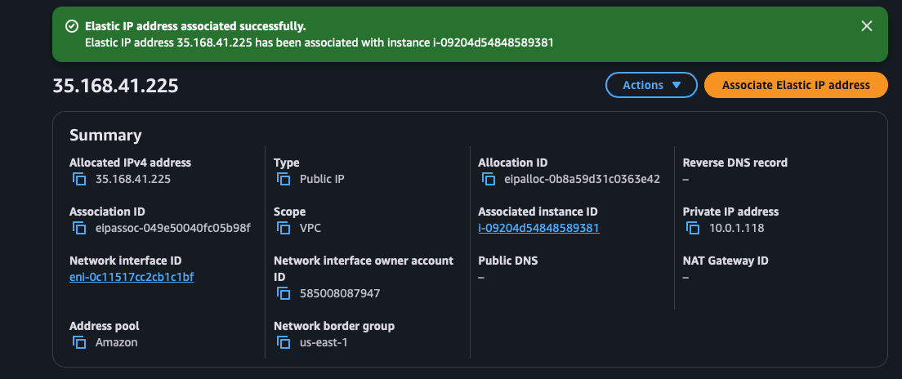**

**Why Elastic IP?**  
An Elastic IP gives you a **static** public IP, so you don’t lose your connection if you stop/start or reboot the Bastion Host. It also simplifies SSH access.

### **Step 7: Connect to Private EC2 via Bastion**
Now that your Bastion Host has a **stable public IP**:
```bash
# Connect to Bastion Host (use your allocated Elastic IP)
ssh -i Public-EC2.pem ubuntu@<Elastic-IP>

# Once on Bastion, connect to the Private EC2 by its private IP
ssh -i Public-EC2.pem ubuntu@<Private-EC2-Private-IP>
- 📸 ****

---

## Security Best Practices
- 🚫 **Disable Password Authentication**: Enforce key-based SSH.
- 📸 **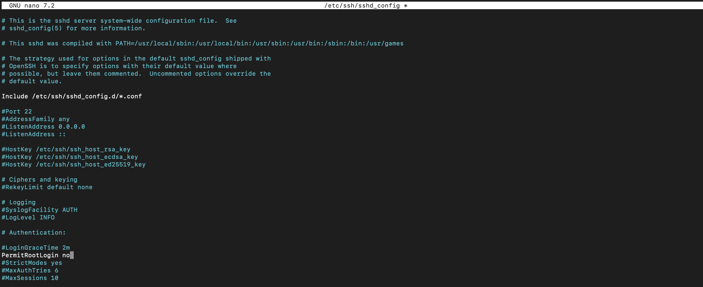**
- 📸 **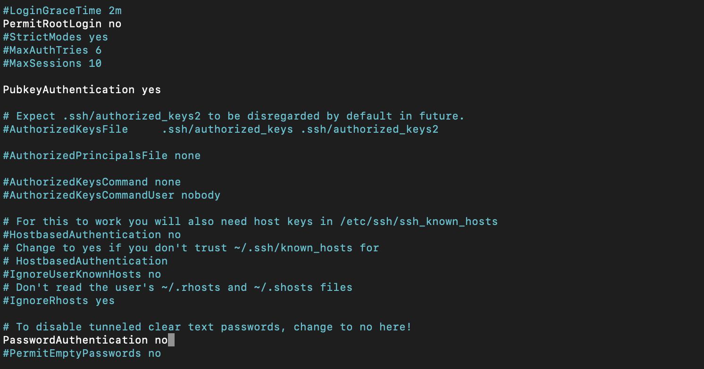**
- 🔒 **Restrict Security Groups**: Limit access by IP.
- 📜 **Enable AWS CloudTrail**: Track API events.
- 🔐 **Use IAM Roles**: Avoid static AWS credentials.
- 📊 **Monitor with AWS GuardDuty & VPC Flow Logs**.

---

## Screenshots
📸 **VPC Dashboard**  
📸 **Security Group Rules**  
📸 **Route Table Configuration**  
📸 **SSH Bastion to Private EC2**  
(All images stored in `screenshots/` folder.)

---

## Troubleshooting
### SSH Connection Issues
If you can’t SSH into the Private EC2:
```bash
ssh -v -i Public-EC2.pem ubuntu@<Private-EC2-IP>
```
Check security group rules and route table settings.

### No Internet from Private EC2
Ensure **NAT Gateway** or Bastion forwarding is set up.
```bash
curl -s ifconfig.me  # Check outbound traffic
```

---

## License
This project is licensed under the **MIT License**.

---

## Acknowledgments
Thanks to **AWS**, **Cloud Security Experts**, and **Cybersecurity Communities** for guidance.

---

### **🔥 Next Steps**
✅ **Upload Configuration & Screenshots**  
✅ **Finalize Documentation**  
✅ **Test Security Measures**  
🚀 **Expand with AWS WAF & Logging**  

---

### **🌟 Contributing**
Pull requests are welcome! If you have security improvements or optimizations, feel free to contribute.

---

🔥 **Project Complete? No, Just the Beginning.** 🚀💾

